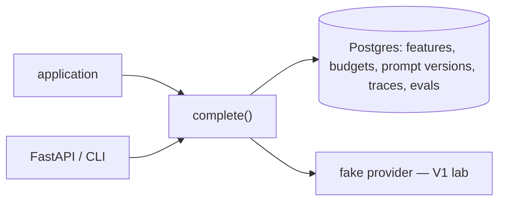
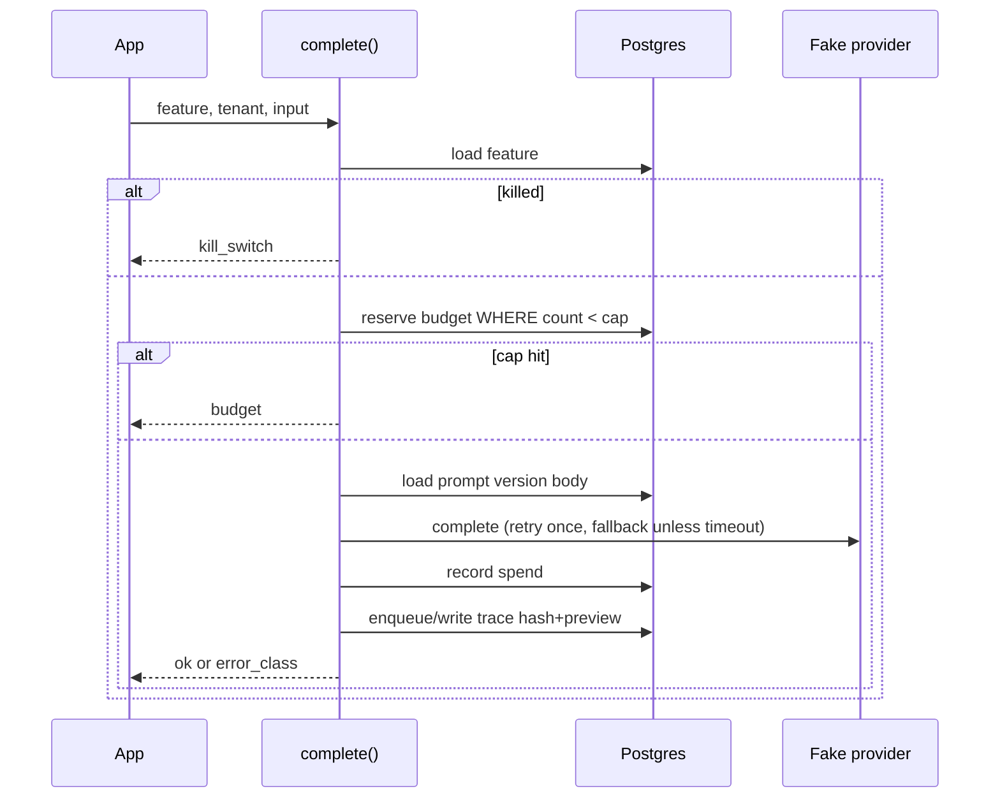

# Architecture

`complete()` is synchronous in the calling process. There is no worker fleet. Kill switch, budget, and prompt version are checked against Postgres before the fake provider runs.

Promote is not this sequence. It is `eval` then a pointer move, refused when the run is blocked or below `PROMOTE_THRESHOLD`.

Default `TRACE_ASYNC=true` writes traces from a bounded in-memory queue. A full queue increments `aicp_trace_queue_drop_total` and still returns the model result. Budget and kill switch stay on the synchronous path. Tests force `TRACE_ASYNC=false`.

## Why Postgres, not Redis

The interesting bug is a lost update on the budget row under concurrency. Redis `INCR` would likely be faster. V1 uses SQL so the race drill is inspectable with `SELECT`. Revisit if the overhead bench shows the row update dominating a real provider’s latency — it will not, until the provider is fake and 5 ms.

## Why a fake provider

A real SDK would dominate every latency histogram and require a secret. The control plane’s job is policy, accounting, and traces. The fake provider is deterministic: `LEAK_PREFIX`, `JSON_ONLY`, `REFUSE_SECRETS` are prompt flags, not model personality.

## Trace retention

Default `store_payloads=false`: SHA-256 of the input plus an 80-character preview. The control plane must not become a PII warehouse because someone wanted a pretty replay UI.

## Eval gate

`promote` requires an eval run id for that feature and version. If `pass_rate < PROMOTE_THRESHOLD` (0.8), the write is refused and a `aicp_promote_events` row records the rejection. Live pointer stays on the previous version.

## Fallback

One retry on retryable errors, then at most one fallback model. Timeouts do not fallback: the caller deadline is already gone. Request budget is reserved once for the logical call, not once per hop. USD spend follows the model that actually produced tokens.

## In-flight kill

The kill switch is read at the start of `complete()`. A call that already passed that check finishes. New calls fail fast. That is the V1 contract, not “cancel the in-flight HTTP request to the vendor.”
